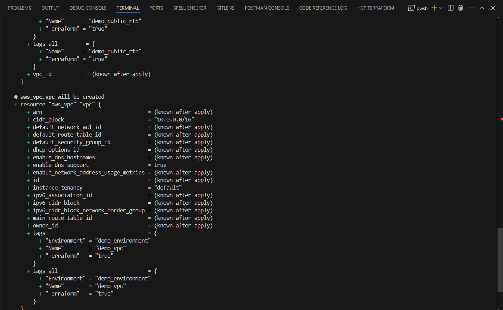
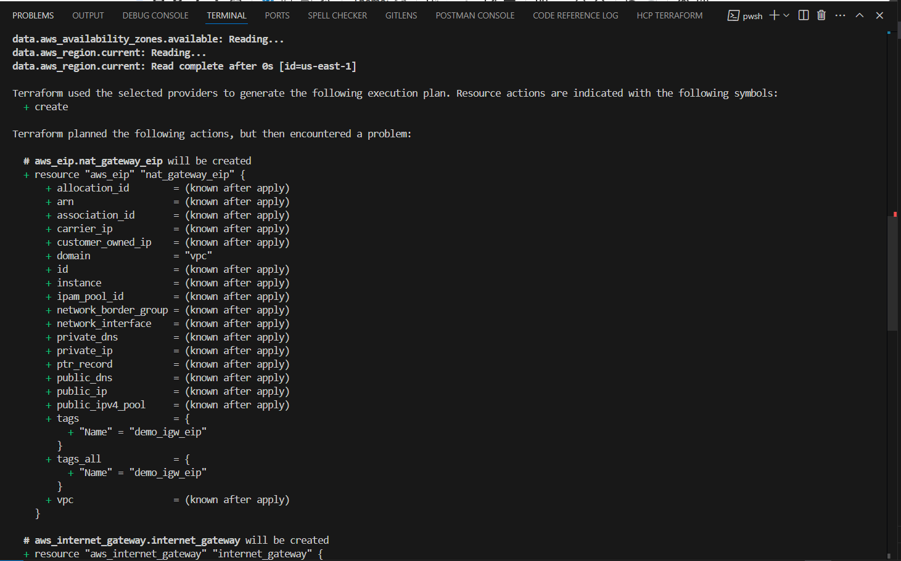

**Name:** David Washington Kamau Kibe

**Tasks Completed:**

* **Completed required hands-on labs** - 26th May 2025, 21:00

  

  
* **Set up blog** - 26th May 2025, 21:45
* **Written and published blog post about today’s task** - *26th May 2025, 21:50*
* **Created social media post about today’s task** - *26th May 2025, 22:00*

  ## 🔗 Related Posts

  - [Check out my blog on Medium about IaC](https://medium.com/@david.kamau.washington/what-is-infrastructure-as-code-iac-and-why-its-transforming-devops-69f2fdc821df)
  - [Check out my LinkedIn post about Day 1 of the Terraform Challenge](https://www.linkedin.com/posts/davidwashingtonkamau_30daytfchallenge-iac-hashicorp-activity-7332843893123653632-MvUn?utm_source=share&utm_medium=member_desktop&rcm=ACoAAE7Yhn0B4r6JF1eNqzo97b9jvzabJQMz9Z8)
* **Updated daily-update.md file with my details** - *26th May 2025, 22:15*
* **Created pull request with all required details** - *26th May 2025, 22:30*
* **Reading Chapter 1 of *Terraform: Up & Running*** - *In progress*

  ***Note**: All times are in Kenyan Time: EAT (GMT +3)*
